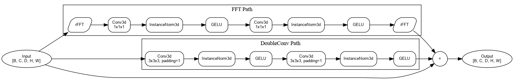
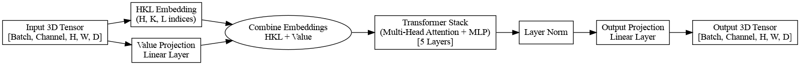
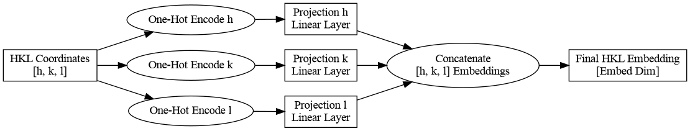

# 🔬 Solving the Phase Problem in Crystallography using AI Methods


## 🎯 Overview

The phase problem is a critical challenge in X-ray crystallography, particularly significant in protein crystallography due to the lack of ab initio solutions in this field. Machine learning methods show promise in addressing this challenge. We propose increasing the resolution of diffraction patterns by using machine learning models to predict distant reflections from nearby ones, potentially enabling ab initio phase problem solutions for biomolecules.

### ✨ Key Features
- A reproducible experimental pipeline following our proposed methodology
- Novel FFT_UNet and XRD_Transformer models specifically designed for this task

## 📚 Background
The X-Ray Diffraction (XRD) phase problem arises from the inability to directly measure phase information during diffraction experiments. When X-rays scatter from a crystal, we can only measure the intensities (or amplitudes of structure factors) of the diffracted beams, but not their phases. This missing phase information makes it challenging to directly determine the crystal structure.

In this project, we aim to solve this problem by reconstructing the complete structure factors using deep learning approaches. The key aspects are:

- **📥 Input Data**: We work with calculated XRD structure factor modules organized in reciprocal space coordinates (h,k,l) (d_min = 1.5 Å)
- **🎯 Target**: Complete set of structure factor modules (d_min = 1.5 Å)
- **🏗️ Model Architectures**:
  - FFT_UNet: For direct spatial feature extraction, upsampling, and Fourier transform processing
  - Transformer: To capture long-range dependencies in reciprocal space
- **🔄 Training**:
  - Loss Function: Mean Squared Error (MSE)
  - Metrics:
    - MSE for overall reconstruction quality
    - R-factor for crystallographic agreement
    - SSIM for structural similarity (not really used because the data is not locally bounded)

## 🛠️ Methods

### Architecture
The framework employs multiple deep learning approaches:

#### 🔹 Baseline: UNet
- Standard UNet architecture for image-to-image translation tasks, adapted for 3D data

#### 🔹 FFT_UNet

- Custom architecture combining 3D convolutions with FFT operations
- Integrated Fourier Transform and inverse FFT layers
- Specialized for processing crystallographic data in reciprocal space
- Leverages both spatial and frequency domain information

#### 🔹 XRD_Transformer Model

- Could be useful for finding long-range attention mechanisms in reciprocal space
- Processes structure factors in reciprocal space coordinates (h,k,l)
- Uses special positional encoding for the h,k,l indices using one-hot encoding

- Architecture parameters:
  - Embedding dimension: 128
  - Depth: 5
  - Number of heads: 4
  - MLP ratio: 4
  - Dropout rates: 0.1

### 📊 Evaluation Metrics
Performance is evaluated using three key metrics:
1. Mean Squared Error (MSE) - For overall reconstruction quality
2. R-factor - For crystallographic agreement
3. Structural Similarity Index (SSIM) - For structural similarity assessment, not really used because of not locally bounded data

## 📈 Results
The framework was trained and tested on a diverse set of monoclinic crystal structures from the Cambridge Structural Database (CSD) and generated synthetic data by our own generator ([XRD Simulator](https://github.com/blackwood168/xrd_simulator)). The final results of testing on CSD structures are:

| Metric | UNet | FFT_UNet | XRD_Transformer |
|--------|------|----------|-----------------|
| MSE·10⁻³ | 1.39 | 1.20 | 1.31 |
| R | 0.393 | **0.336** | 0.358 |

## 🚀 Getting Started

### Installation & Usage
1. Clone the repository
```
git clone https://github.com/blackwood168/xrd_phase_ml.git
``` 
2. Install dependencies
```
pip install -r requirements.txt
```
3. Configure the training parameters in the config file (configs/train.yaml)
4. Run the training pipeline using the provided notebook (interaction.ipynb)
5. Run the testing pipeline using the provided notebook after changing the weights path in config file (test.yaml)
6. (Optional) Run the inference notebook (inference.ipynb) to visualize the results and try to solve the phase problem with SHELXT

## 📄 License
This project is released under the CC0 1.0 Universal license. This means you can copy, modify, distribute and perform the work, even for commercial purposes, all without asking permission.

## 📝 Citation
If you use this work in your research, please cite:

## 🙏 Acknowledgments
**Work is greatly supported by Non-commercial Foundation for the Advancement of Science and Education INTELLECT**

## 📫 Contact
For questions about the implementation or to report issues, please open an issue in the repository.