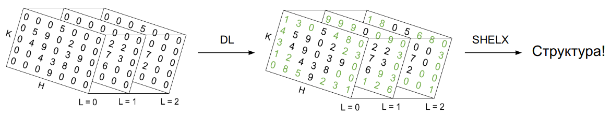

# Solving the phase problem in crystallography using AI methods

  
*Solving the phase problem in crystallography using AI methods*

## Description
This project introduces a novel deep learning framework for solving the phase problem in crystallography. 

## Methods
The architecture used is 3D-UNet with 3D-FT layers, which consist of Fourier Transform, 3D-convolutional layers and inverse Fourier Transform.
